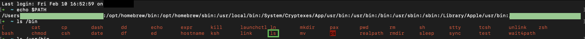
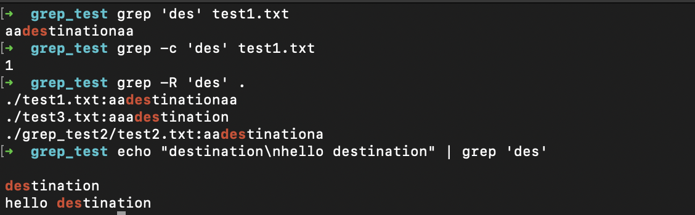
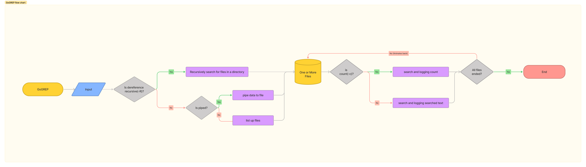
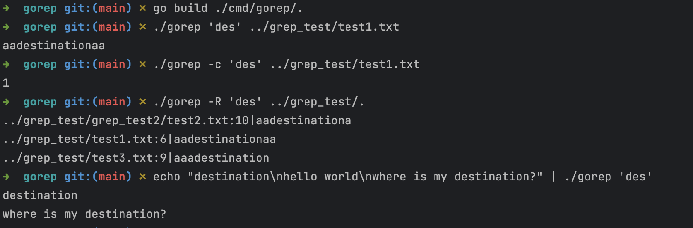

## 시작 전에

해당 시리즈는 두 포스트로 구성 됩니다.
- 밑바닥부터 구현하는 리눅스 커맨드 라인 - 1. 분석 및 기본 구현
   - 리눅스 커맨드 라인은 어떻게 작동 하는가
   - grep에 대한 이야기
   - grep에서 구현해볼 것
   - gorep의 flow chart
   - 구현
   - 결과
   - reference
- 밑바닥부터 구현하는 리눅스 커맨드 라인 - 2. 동시성 프로그래밍으로 리팩토링하기
  - TBD

필자 역시 go 언어를 공부하는 과정 중에 있기 때문에 잘못된 접근을 하거나 효율적이지 않은 코드를 작성할 수 있습니다. 다른 의견 있으시면 lak9348@gmail.com로 연락 주세요 :)

---
## 리눅스 커맨드 라인은 어떻게 작동 하는가

클라우드 컴퓨팅에 관한 경험이 있거나 맥을 사용하고 있다면 터미널 & 리눅스 커맨드라인이 익숙하실 겁니다. 필자 역시 터미널을 키고 ls, cd, cp 등의 명령어 들을 사용합니다. 우리는 이런 명령어에 대해 어떻게 처리하라고 컴퓨터에 코딩 한 적이 없는데 컴퓨터는 어떻게 해당 명령어들을 처리할까요?

컴퓨터는 사용자가 입력한 명령어를 3가지 단계에 나누어 인식 합니다.
1. alias가 있는지 확인
2. alias가 아니라면 built-in command[[1]](https://www.gnu.org/software/bash/manual/html_node/Shell-Builtin-Commands.html) 인지 확인
3. 모두 해당하지 않는다면 $PATH 로 지정된 디렉토리에 해당 커맨드라인이 있는지 확인

대부분의 기본 명령어 들은 3번째에 해당합니다. 예컨대 ls 명령어의 경우 $PATH 중 /bin 디렉토리에 실행 가능한 파일 형태로 존재합니다.(필자는 mac을 사용중입니다)
</br></br>

</br></br>
리눅스 커맨드라인이 어떻게 동작 하는지 더 잘 알고 싶으신 분들은 'How Does the Shell Command ls Work?'[[2]](https://medium.com/@bdov_/what-happens-when-you-type-ls-c-in-the-shell-93327856ee9c)을 참고하시기 바랍니다.

## grep에 대한 이야기

이번 시리즈에서는 grep을 구현해볼 것 입니다. grep역시 리눅스의 기본 커맨드라인 중 하나입니다. grep은 입력으로 전달된 하나 이상의 파일의 내용에서 특정 문자열을 찾고자할 때 사용하는 명령어입니다.
grep은 문자열을 찾을 때 보이어무어 문자열 검색 알고리즘(Boyer–Moore string-search algorithm)을 이용 합니다[[3]](https://en.wikipedia.org/wiki/Boyer%E2%80%93Moore_string-search_algorithm#Implementations). 해당 알고리즘은 go 언어의 기본 문자열 검색 알고리즘으로도 채택되어 사용되고 있습니다.[[4]](https://go.dev/src/strings/search.go)
다음 문단부터 본격적으로 grep을 구현해 보도록 하겠습니다.

---
## grep에서 구현해볼 것

grep 명령어 중 대표적으로 사용되는 몇가지를 구현해 보겠습니다. (정규표현식을 사용하지 않습니다)
```shell
# 기본 검색입니다. grep 'pattern' [filename...]
> grep 'pattern' filename
# -R 옵션을 사용하면 해당 디렉토리 및 하위 디렉토리의 모든 파일에 대해 grep을 실행합니다.
> grep -R 'pattern' .
# -c 옵션을 사용하면 pattern 이 몇번 반복되었는지 수를 나타냅니다.
> grep -c 'pattern' filename
# 앞선 커맨드의 결과를 파이프연산으로 입력받아 grep을 수행합니다.
> echo "문자열" | grep 'pattern'
```
아래는 해당 커맨드들을 사용한 예제입니다.
</br></br>


저희가 만드는 grep을 gorep이라 칭하겠습니다. 모든 소스코드는 해당 링크에 있습니다. [[5]](https://github.com/namkyu1999/gorep)

## gorep의 flow chart

위 요건들을 충족하기 위해 다음과 같은 플로우 차트를 구성하였습니다. 최소 요건을 구현한 것이므로 실제 grep 구현과는 차이가 있을 수 있습니다.
</br></br>

</br></br>

## 구현

구현을 해보도록 하겠습니다. go 프로젝트를 생성 하고 `cmd/gorep/` 하위에 main.go를 만듭니다. go언어에서는 보통 cmd 폴더 안에 main 프로그램을 작성합니다. 또한 cmd 하위에 폴더를 생성하고 그곳에 main함수를 위치시키면 빌드시 해당 폴더 이름으로 실행 가능한 바이너리 파일이 나옵니다. go언어의 프로젝트 레이아웃에 대해 더 알고 싶은 분들은 해당 링크를 참고하시기 바랍니다[[6]](https://github.com/golang-standards/project-layout). 

grep의 경우 옵션, 패턴, 파일 이름 등 프로그램 외부에서 값을 받아와야 합니다. 마찬가지로 `cmd/gorep/` 에 `config.go` 를 작성합니다.

```go
package main

type configuration struct {
	dereferenceRecursive bool // -R 여부
	count                bool // -c 여부
	pattern              string // 받은 pattern 값
	fileName             []string // 파일 이름. 복수의 파일 가능
	fromPipe             bool // pipe를 통해 값을 전달받는지 여부
}
```

 go 언어는 같은 패키지안에 존재 하지 않는 경우 소문자로 시작하는 struct나 method, function등을 불러올 수 없습니다.[[7]](https://go.dev/tour/basics/3) 이번 프로그램은 모두 main 패키지 내에서 사용되고 다른 패키지에서는 참조를 하지 않기 때문에 모두 소문자로 시작합니다. 

```go
const invalidArgument = "invalid argument count"
const cannotCreatTemp = "cannot create temp file"
const cannotReadFromPipe = "cannot read from pipe"
const cannotWriteTemp = "cannot write to temp file"

// 외부 입력 값들을 받아오는 함수입니다.
func setup() (configuration, error) {
	var config configuration
	var dereferenceRecursive, count bool

  // 옵션 들을 go언어의 기본 패키지은 flag를 통해 받습니다.
  // 실행 시 ./gorep -R 'pattern' filename 으로 받는다면,
  // 옵션으로 -R 이 true로 설정되고 -c는 받지 않았기 때문에 false가 됩니다.
	flag.BoolVar(&dereferenceRecursive, "R", false, "dereference recursive")
	flag.BoolVar(&count, "c", false, "count")
	flag.Parse()
  // 옵션을 제외한 인자들은 Args에 해당합니다.
	tail := flag.Args()

  // 파이프를 통해 값을 받아오는지 확인하는 조건문입니다.
  // grep에서는 -R 옵션을 사용할 경우 파이프 입력을 허용하지 않습니다.
	if fi, _ := os.Stdin.Stat(); !dereferenceRecursive && (fi.Mode()&os.ModeCharDevice) == 0 {
    // -R 옵션 사용하지 않았고 파이프로 입력받은 경우
    // 임시 파일을 생성하여 해당 파일에 pipe로 입력받은 값을 저장합니다.
    // 그리고 저장된 파일의 이름을 검색 파일 대상에 추가합니다.
		tmpFile, err := os.CreateTemp("", "gorep")
		if err != nil {
			return config, errors.New(cannotCreatTemp)
		}

		line, err := io.ReadAll(os.Stdin)
		if err != nil {
			return config, errors.New(cannotReadFromPipe)
		}

		err = os.WriteFile(tmpFile.Name(), line, 0644)
		if err != nil {
			return config, errors.New(cannotWriteTemp)
		}
    // defer 함수의 경우 return 직전에 실행됩니다.
		defer tmpFile.Close()
		return configuration{
			dereferenceRecursive: dereferenceRecursive,
			count:                count,
			pattern:              tail[0],
			fileName:             []string{tmpFile.Name()},
			fromPipe:             true,
		}, nil
	} else if len(tail) < 2 {
    // 파이프를 통해 값을 받지 않았으며 인자로 두개 이상 (패턴이름, 파일/폴더 이름)을 
    // 받지 않은경우 에러를 리턴합니다.
		return config, errors.New(invalidArgument)
	} else {
		return configuration{
			dereferenceRecursive: dereferenceRecursive,
			count:                count,
			pattern:              tail[0],
			fileName:             tail[1:],
			fromPipe:             false,
		}, nil
	}
}
```

한가지만 짚고 넘어가겠습니다. go언어 위키에는 포인터 대신 값을 전달하라는 조언을 합니다.[[8]](https://github.com/golang/go/wiki/CodeReviewComments#pass-values) go언어는 가비지 컬렉션이 jvm계열의 언어와는 다르게 동작하는 부분이 있습니다. 바로 기본 값을 비롯하여 struct, slice 등 많은 요소들이 스택에 저장됩니다.(자바의 경우 객체는 heap에 저장됩니다) 만약 해당 함수 범위 밖에서 계속 struct나 slice를 사용하고 싶은 경우 포인터를 리턴하게 되고 이때 go 런타임에서는 해당 자료형들을 stack에서 heap으로 옮기게 됩니다. heap 영역이 커질수록 접근에 대한 속도가 느리고 가비지 컬렉터의 부담이 추가됩니다. 따라서 포인터 대신 값을 리턴해야 합니다. 이에 대해서는 '러닝 Go' 의 chapter6 부분을 확인해보시기 바랍니다. [[9]](https://product.kyobobook.co.kr/detail/S000001810487)
 </br>
다음은 이전에 생성하였던 `main.go` 함수입니다.

```go
package main

func main() {
  // config.go에서 작성한 setup() 함수를 불러옵니다.
  // 같은 패키지 내에 정의된 함수이기 때문에 exported name이 아니어도 됩니다.
	config, err := setup()
	if err != nil {
		fmt.Errorf(err.Error())
		os.Exit(2)
	}
  // -R 옵션을 사용하였을 경우 하위 폴더들을 순회하여 파일들을
  // 검색 대상으로 추가하는 코드입니다.
	if config.dereferenceRecursive {
		paths := make([]string, 0)
		err := filepath.Walk(config.fileName[0],
			func(path string, info os.FileInfo, err error) error {
				if err != nil {
					return err
				}
				if !info.IsDir() {
					paths = append(paths, path)
				}
				return nil
			})
		if err != nil {
			fmt.Errorf(err.Error())
			os.Exit(2)
		}
		config.fileName = paths
	}

  // -c 옵션을 사용하였을 경우 count를 반환하는 함수를 실행합니다.
  // 그렇지 않을 경우 pattern이 발견된 문자열을 출력하는 함수를 실행합니다.
	if printPrefix := len(config.fileName) > 1; config.count {
		for _, fileName := range config.fileName {
			searchCount(fileName, config.pattern, printPrefix)
		}
	} else {
		for _, fileName := range config.fileName {
			search(fileName, config.pattern, printPrefix)
		}
	}
}
```

`main.go`에 작성된 함수 중 `search`와 `searchCount` 함수는 아직 구현되지 않았습니다. `cmd/gorep/` 에 `search.go` 를 작성합니다.

```go
package main

const cannotReadFile = "unable to read file: %v"
const errorWhileReadFile = "Error while reading file: %s"
const searchResultTemplate = "%s:%d|%s\n"
const countResultTemplate = "%s:%d\n"

func search(filename, pattern string, printPrefix bool) {
  // 검색 대상이 되는 파일을 open 합니다.
	file, err := os.Open(filename)
	if err != nil {
		log.Fatalf(cannotReadFile, err)
	}

	defer file.Close()
	fileScanner := bufio.NewScanner(file)

	lineNumber := 0
	for fileScanner.Scan() {
		line := fileScanner.Text()
    // go 언어의 문자열 검색은 grep과 동일하게 
    // boyer-moore string search 알고리즘을 사용합니다.
    // strings.Index 함수의 경우 위 알고리즘을 내부적으로 실행합니다.
    // 패턴이 발견되면 해당 문자열 속 해당 패턴의 첫 인덱스를 반환하고 
    // 반환되지 않을 경우 -1을 리턴합니다.
		if index := strings.Index(line, pattern); index > -1 {
			if printPrefix {
				fmt.Printf(searchResultTemplate, file.Name(), lineNumber, line)
			} else {
				fmt.Println(line)
			}
		}
		lineNumber++
	}
	if err := fileScanner.Err(); err != nil {
		log.Fatalf(errorWhileReadFile, err)
	}
}
```

`searchCount` 함수는 `search`함수와 거의 유사합니다.

```go
func searchCount(filename, pattern string, printPrefix bool) {
	file, err := os.Open(filename)
	if err != nil {
		log.Fatalf(cannotReadFile, err)
	}

	defer file.Close()
	fileScanner := bufio.NewScanner(file)

	count := 0
	for fileScanner.Scan() {
		line := fileScanner.Text()
    // strings.Count 함수 역시 내부적으로 
    // boyer-moore string search 알고리즘을 사용합니다.
		count += strings.Count(line, pattern)
	}

	if err := fileScanner.Err(); err != nil {
		log.Fatalf(errorWhileReadFile, err)
	}

	if count != 0 {
		if printPrefix {
			fmt.Printf(countResultTemplate, file.Name(), count)
		} else {
			fmt.Println(count)
		}
	}
}
```

## 결과
프로젝트의 root 디렉토리로 이동 한 후 `go build ./cmd/gorep/.`을 실행한 경우 unix계열의 컴퓨터에서는 `gorep` 이라는 실행 파일이 나오고 윈도우 에서는 `gorep.exe` 파일이 생성됩니다.
</br></br>
아래와 같이 몇가지 명령어를 실행 하였고 모두 정상 작동이 되는 것을 확인하였습니다.
</br></br>

</br></br>

해당 실행 파일을 $PATH 하위에 두거나 현재 디렉토리를 $PATH에 추가하면 ./ 없이 명령어 처럼 이용 가능합니다. </br>
이번 포스트에서는 리눅스 커맨드라인이 어떻게 동작하는지 살펴보고 grep을 간단하게 구현해보는 시간을 가져보았습니다. 다음 포스트 에서는 좀더 빠른 실행 속도를 위해 동시성 프로그래밍을 사용하여 코드를 리팩토링 해보겠습니다.

## reference
[1] [Shell Builtin Commands](https://www.gnu.org/software/bash/manual/html_node/Shell-Builtin-Commands.html) </br>
[2] [How Does the Shell Command ls Work?](https://medium.com/@bdov_/what-happens-when-you-type-ls-c-in-the-shell-93327856ee9c) </br>
[3] [Boyer–Moore string-search algorithm implementations](https://en.wikipedia.org/wiki/Boyer%E2%80%93Moore_string-search_algorithm#Implementations) </br>
[4] [Boyer-Moore string-search alogrithm in golang](https://go.dev/src/strings/search.go) </br>
[5] [gorep github 주소](https://github.com/namkyu1999/gorep) </br>
[6] [golang project layout](https://github.com/golang-standards/project-layout) </br>
[7] [exported names](https://go.dev/tour/basics/3) </br>
[8] [pass value instead of pointer](https://github.com/golang/go/wiki/CodeReviewComments#pass-values) </br>
[9] [러닝 Go](https://product.kyobobook.co.kr/detail/S000001810487) </br>