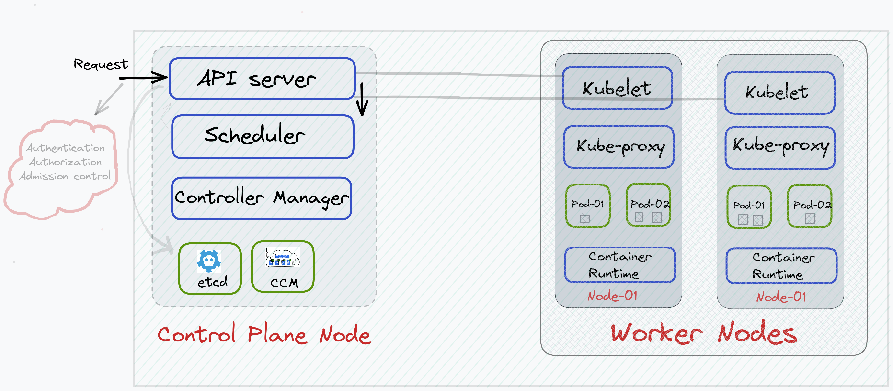

## 시작 전에

> "Understanding the Architecture of Kubernetes: A Beginner's Guide"[[1]](https://blog.kubesimplify.com/understanding-the-architecture-of-kubernetes-a-beginners-guide)라는 제목의 글을 원작자의 허락을 받아 번역하였습니다.

'쿠버네티스(kubernetes)를 사용한다.' 라는 말에는 함축된 한가지가 있습니다. '완전 관리형 쿠버네티스를 사용한다.' 입니다. 실제로 마스터 노드를 관리하는 사람들은 극히 드물며, 클라우드의 편의성에 따라 EKS, GKE, OpenShift등 완전 관리형 쿠버네티스를 사용하는 경우가 대부분일 것입니다. 그렇기 때문에 쿠버네티스의 아키텍처를 이해하지 않고도 쿠버네티스 위에 다양한 애플리케이션을 배포할 수 있습니다(그리고 이런 추상화는 꽤 긍정적이라 생각합니다). 하지만 클라우드 네이티브로의 전환이 이루어지고 있는 요즘, 단순히 애플리케이션을 도커로 감싸서 배포하는 것에 답답함을 느낄 때가 있습니다. 쿠버네티스의 리소스들을 제대로 이해하고 애플리케이션을 개발한다면, 더 적은 자원으로 더 큰 효용을 느낄 수 있을 것입니다. 이번 포스트는 Nitish Kumar 님이 작성하신 포스트를 허락을 받고 번역하였습니다. 쿠버네티스를 한번이라도 사용하신 분이라면 이해하기 더 쉬울 것 같습니다.

---

쿠버네티스는 클라우드 컴퓨팅 분야에 돌풍을 일으키고 있는 강력한 컨테이너 오케스트레이션 시스템(container orchestration system) 입니다. 쿠버네티스는 여러 호스트들에서 컨테이너들을 관리하고 확장할 수 있는 능력을 가지고 있는데, 덕분에 쿠버네티스는 프로덕션 환경에서 컨테이너화된 애플리케이션을 실행하는데 가장 많이 사용되는 플랫폼이 되었습니다. 이번 포스트에서는 쿠버네티스의 아키텍처를 조금 더 면밀히 파악하고 컨테이너화된 애플리케이션들이 어떻게 관리되고 확장되는지 알아보겠습니다.

아래의 그림은 오늘 우리가 살펴볼 쿠버네티스 아키텍처의 큰그림입니다. 화살표가 무엇을 의미하는지, API 서버가 무엇인지, Kubelet에서 API 서버로 향하는 라인이 무엇인지, 컨트롤 플레인(Control plane)과 워커 노드(worker node)간의 차이점이 무엇인지, 컨트롤 플레인의 존재이유가 무엇인지 등 수많은 질문들에 대한 답을 이 포스트를 통해 알아가시기 바랍니다.


본론으로 들어가기에 앞서, 쿠버네티스 생태계에서 자주 쓰이는 용어를 먼저 짚고 넘어가겠습니다.
1. 노드(Node): 쿠버네티스에서 노드는 쿠버네티스 클러스터에 존재하는 하나의 머신(컴퓨터)를 의미합니다. 프로덕션 환경에서 노드는 주로 데이터센터에 존재하는 물리적인 머신이나 클라우드에서 호스트되는 가상 머신이 될 수 있습니다.
2. 파드(Pod): 쿠버네티스는 컨테이너를 직접 실행하지 않습니다. 대신 컨테이너를 파드에 감싸서 실행합니다(파드는 쿠버네티스에서 생성하고 관리할 수 있는 배포 가능한 가장 작은 컴퓨팅 단위입니다[[2]](https://kubernetes.io/ko/docs/concepts/workloads/pods/)). 파드는 노드 안에서 실행됩니다. 컨테이너는 파드 안에서 실행됩니다. 애플리케이션은 컨테이너 안에서 실행됩니다.

3. 클러스터(Cluster): 클러스터는 컨테이너화된 애플리케이션을 실행하는 노드들의 집합입니다. 노드가 물리적인 노드인지 가상의 노드인지는 상관 없습니다.

---

본격적으로 쿠버네티스의 아키텍처를 이해해보겠습니다.



위 이미지를 자세히 살펴보겠습니다. 우리는 3개의 노드(1개의 컨트롤 플레인 노드 & 2개의 워커 노드)를 하나의 쿠버네티스 클러스터로 묶었습니다. 이 숫자는 고정된 것이 아니며 요구 사항에 따라 자유롭게 조정할 수 있습니다.

모든 쿠버네티스 클러스터에는 두 종류의 노드가 존재합니다.
1. 하나 이상의 **컨트롤 플레인 노드(Control Plane Node)**, **마스터 노드(Master Node)** 로도 불립니다.
2. 하나 이상의 **워커 노드(Worker Node)**

다시 위의 그림을 보시면, 각가의 노드가 몇개의 관련된 컴포넌트를 가지고 있음을 알 수 있습니다. 컨트롤 플레인 노드는 API server, Scheduler 와 같은 컴포넌트를 가지고 있습니다. 반면에 워커 노드는  kubelet, kube-proxy 와 같은 컴포넌트를 가지고 있습니다. 헤당 노드들에서의 각각의 컴포넌트의 역할이 무엇인지 알아보겠습니다.

워커 노드의 역할은 여러분의 애플리케이션을 실행시키는 것 입니다(위 그림에서 보신 것 처럼 파드들은 워커노드 안에서 존재합니다). 반면에 컨트롤 플레인 노드는 클러스터를 실행하고, 클러스터에 새 노드를 추가하고, 파드들을 scaling 하는 등의 클러스터 운영을 담당합니다.

이러한 이유로 만약 컨트롤 플레인 노드가 존재하지 않다면 여러분의 쿠버네티스 클러스터는 시작조차 되지 못할 것입니다. 그만큼 컨트롤 플레인 노드를 잘 관리하는 것은 매우 중요합니다.

### 컨트롤 플레인 컴포넌트

이제부터 컨트롤 플레인의 각 컴포넌트들의 쓰임새에 대해 설명하겠습니다.
1. **API Server** : 쿠버네티스 클러스터에서 모든 운영에 관여하는 두뇌 역할을 합니다. 클러스터와 상호작용을 하기위해서는 모든 요청을 API server로 보내야 합니다. API Server는 모든 유저, 관리자, 개발자, 운영자, 외부 에이전트가 보낸 REST 요청을 가로채 유효성을 검증한 다음 이후 프로세스를 진행시킵니다. 사용자가 API server에 요청을 보낼 때마다 API server는 다음의 세 가지 작업을 수행합니다(더 자세하게 알고싶으신 분은 이곳에서 확인 바랍니다[[3]](https://www.oreilly.com/library/view/managing-kubernetes/9781492033905/ch04.html)).
    - Authentication : 유저에 대한 인증을 수행합니다.
    - Authorization : RBAC를 활용하여 해당 요청이 인증된 사용자가 보낸 요청인지 확인합니다.
    - Admission control : 인증, 권한 확인 이후 추가적인 요청에 대한 검증이나 요청 내용을 강제로 변경할 때 사용합니다(이 부분에 대해서는 이 포스트[[4]](https://coffeewhale.com/kubernetes/admission-control/2021/04/28/opa1/)를 참고하면 이해가 쉽습니다).
2. **Scheduler** : 스케쥴러의 가장 큰 역할은 노드들에 파드를 할당하는 것입니다. 만약 사용자가 API server에게 커맨드라인을 통해 파드(혹은 컨테이너)를 새로 생성해본다고 가정해보겠습니다. 해당 요청은 API server에서 authentication, authorization & admission control를 거친 이후 스케쥴러에게 전달될 것입니다. 스케쥴러에서는 해당 파드를 실행할 최적의 워커노드를 찾습니다. 스케쥴러는 스케쥴링 queue에 존재하는 파드를 우선순위에 맞게 꺼내옵니다. 그리고 리소스 사용 가능여부등으로 순위가 매겨진 노드들 중 가장 점수가 높은 노드를 선택합니다. 이후 선택된 노드와 파드를 바인딩합니다(관련 Docs는 이곳에서 확인가능합니다[[5]](https://kubernetes.io/docs/concepts/scheduling-eviction/scheduling-framework/#extension-points)).
3. **Controller Manager** : 컨트롤러 매니저는 컨트롤러나 오퍼레이터를 실행함으로써 쿠버네티스 상태를 규제하는 컴포넌트입니다. 컨트롤러는 클러스터의 실제 상태와 desired 상태를 비교하는 watch-loop 프로세스 입니다. 그렇다면 프로세스의 상태는 어디에 저장될까요? Etcd store 입니다.

**Key-Value data store(etcd)** : 클러스터와 관련된 모든 정보는 etcd store에 저장됩니다. 우리가 실행하는 애플리케이션 데이터는 etcd에 저장되지 않습니다. etcd에 저장되는 데이터는 덮어써지지 않고 추가되는 구조입니다. 오래된 데이터는 etcd store의 크기를 최소화 하기 위해 주기적으로 압축(compact) 됩니다. etcd는 Raft 합의 알고리즘[[6]](https://en.wikipedia.org/wiki/Raft_(algorithm))을 채택하여 사용하고 있습니다. 지금부터는 앞서 이야기 했던 '스케쥴러가 노드를 선택하여 파드를 실행시키는 과정'을 하나씩 살펴보겠습니다.
- 클라이언트가 '파드를 새로 실행' 시키는 요청은 API server로 전달됩니다.
- API server 는 유저와 요청을 검증합니다.
- 검증을 마친 요청은 스케쥴러에게 전달됩니다.
- 스케쥴러는 워커노드 리소스 사용 여부와 같은 클러스터와 관련된 정보를 API server에 요청합니다.
- etcd store에 접근할 수 있는 컴포넌트는 API server가 유일합니다. 다른 컴포넌트는 etcd store에 직접 접근할 수 없습니다.
- API server는 etcd store로 부터 정보를 가져와 스케쥴러에게 제공합니다.
- API server로 부터 받은 정보들을 기반으로 스케쥴러는 노드와 파드를 바인딩합니다.

그렇다면 이제 파드는 실행되는 걸까요? 아닙니다. 위의 과정은 파드를 실행하기 위한 최적의 노드를 선택했음을 의미하며 파드의 실행과는 무관합니다(이와 관련해서는 워커노드 부분에서 서술합니다).

**Cloud Controller Manager(CCM)**: CCM은 컨트롤러와 오퍼레이터를 실행합니다. 이는 노드들이 사용이 불가할 때 AWS 같은 클라우드 인프라와 상호작용하기 위해 필요합니다. (자세한 이야기는 Docs[[7]](https://kubernetes.io/docs/concepts/architecture/cloud-controller/)를 참고하시기 바랍니다)

컨트롤 플레인에 대한 설명을 마쳤습니다. 지금부터는 워커노드들의 각 컴포넌트에 대해 알아보겠습니다.

### 워커노드 컴포넌트

워커노드는 컨테이너화된 애플리케이션이 실행하는 환경을 제공합니다. 워커노드의 대표적인 컴포넌트는 다음과 같습니다.
- Kubelet
- kube-proxy
- container runtime
- Addons or DNS

1. **Container runtime** : 쿠버네티스가 '컨테이너 오케스트레이션 툴'로 인식되지만 컨테이너를 직접 실행하지 않습니다. 따라서 컨테이너의 라이프사이클을 관리하기 위해 파드가 스케쥴된 노드에 컨테이너 런타임이 필요합니다. 중요한 점은 컨테이너 런타임이 컨트롤 플레인 노드와 워커노드 모두에 존재해야 한다는 것입니다. 쿠버네티스는 아래와 같은 몇개의 컨테이너 런타임을 제공합니다.
    - CRI-O
    - containerd
    - Docker
    - Mirantis Container Runtime
    
2. **Kubelet**: 컨테이너 런타임과 동일하게 kubelet 또한 컨트롤 플레인 노드와 워커 노드 모두에 존재합니다. 워커노드에 파드를 실행하기 위해, 파드를 실행과 관련하여 컨트롤 플레인 노드와 소통하는 컴포넌트가 존재해야 합니다. kubelet은 이 역할을 수행합니다. 각 노드에 존재한 kubelet은 control plane 노드와 상호작용 하며 파드를 실행하기 위해 API server의 명령을 기다립니다. API server로부터 kubelet이 메시지를 수신한 이후, Kubelet은 해당 노드에 존재하는 컨테이너 런타임과 플러그인 기반 인터페이스(CRI shim)를 통해 상호작용합니다. 이후 파드가 실행됩니다.

지금 까지 배웠던 것들을 통해 파드가 실행되는 과정을 다시한번 살펴보겠습니다.
- 유저는 다음과 같은 커멘트를 통해 API server 에게 파드를 실행시켜달라고 요청합니다.    
    ```shell
    kubectl run <pod-name> --image=<image-name>
    ```
- 해당 요청은 API server에 의해 검증됩니다.
- API server는 검증된 요청을 control plane 노드에 존재하는 스케쥴러에게 보냅니다.
- 스케쥴러는 클러스터와 관련된 정보를 API server에게 요청합니다(API server가 etcd store에 접근할 수 있는 유일한 클러스터이기 때문입니다).
- API server는 클러스터에 대한 정보를 스케쥴러에게 전달합니다.
- 정보를 수신한 스케쥴러는 해당 정보를 기반으로 노드를 선택하여 파드를 노드에 바인딩합니다.
- 바인딩 정보를 API server에게 전달합니다.
- API server는 해당 노드에 존재하는 kubelet에 파드를 실행하도록 할당합니다.
- kubelet은 해당 노드에 있는 컨테이너 런타임과 CRI shim를 통해 상호작용합니다. 그리고 컨테이너 런타임에서 해당 파드를 실행시킵니다. 파드가 실행되는 동안, 컨트롤러 매니저는 클러스터의 실제 상태와 desired 상태가 일치하는지 계속해서 체크합니다. 

    

---

마지막으로, 워커노드의 컴포넌트인 kube-proxy & addons에 대해 알아보겠습니다.

**Kube-proxy** (각 노드에서 실행됩니다)는 쿠버네티스 안에서 네트워크 규칙을 담당합니다. 예를 들어
- 컨테이너-컨테이너 커뮤니케이션
- 파드-파드 커뮤니케이션
- 파드-서비스 커뮤니케이션
- 외부-서비스 커뮤니케이션

**Addons** 은 서드파티 파드 및 서비스를 통해 구현되는 클러스터 기능입니다. 예를 들어, 대시보드는 웹 UI를 통해 클러스터를 관리하기 위한 범용(general-purpose) 사용자 인터페이스입니다.

마지막으로 이 포스트 초반에 보여드린 그림을 다시 한번 봐주시기 바랍니다. 이제 해당 그림을 온전히 이해하셨길 바랍니다. 감사합니다 :)


### Reference
[1] [Understanding the Architecture of Kubernetes: A Beginner's Guide](https://blog.kubesimplify.com/understanding-the-architecture-of-kubernetes-a-beginners-guide)

[2] [Pod](https://kubernetes.io/ko/docs/concepts/workloads/pods/)

[3] [Life of a Request](https://www.oreilly.com/library/view/managing-kubernetes/9781492033905/ch04.html)

[4] [Admission control](https://coffeewhale.com/kubernetes/admission-control/2021/04/28/opa1/)

[5] [Scheduling framework](https://kubernetes.io/docs/concepts/scheduling-eviction/scheduling-framework/#extension-points)

[6] [Raft Consensus Algorithm](https://en.wikipedia.org/wiki/Raft_(algorithm))

[7] [Cloud Controller Manager](https://kubernetes.io/docs/concepts/architecture/cloud-controller/)